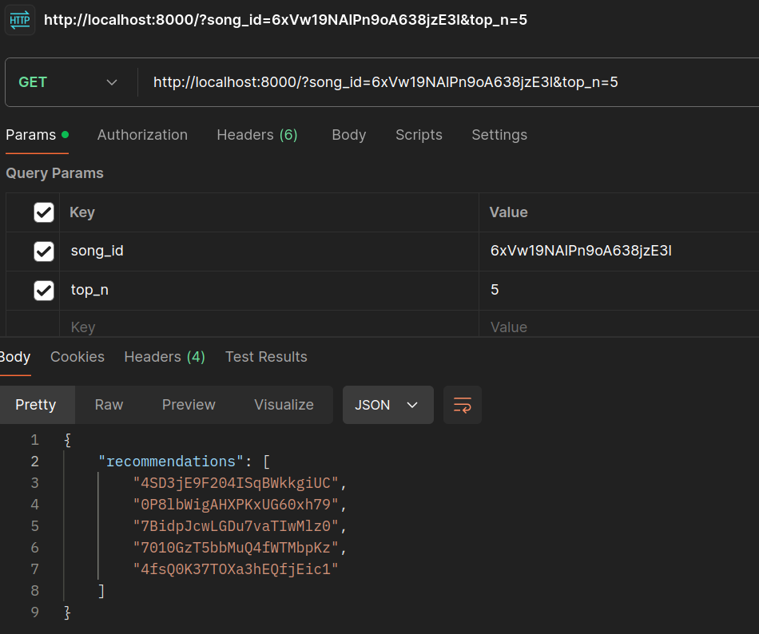

# Fast Track v2

[](https://github.com/yubelgg/fast-track-v2/blob/main/LICENSE)
[](https://www.python.org/)
[](https://nextjs.org/)
[](https://developer.spotify.com/documentation/web-api/)

Fast Track v2 leverages Spotify's API to enhance your music experience and help you explore new music seamlessly. This project demonstrates the implementation of 3-legged OAuth authentication for secure and seamless user authorization, alongside a robust backend recommendation system to provide personalized song suggestions.

## Table of Contents

- [Features](#features)
- [Tech Stack](#tech-stack)
- [OAuth Implementation](#oauth-implementation)
- [Testing](#testing)
- [Known Issues](#known-issues)
- [Usage](#usage)
- [Current Development](#current-development)
- [Future Enhancements](#future-enhancements)
- [Previous Development](#previous-development)
- [License](#license)

## Features

- **Secure User Authentication:**
  - Implements Spotify's **3-legged OAuth 2.0** flow using **Next-Auth**, ensuring secure and authorized access to user data.
  
- **Dashboard Interface:**
  - Intuitive dashboard allowing users to **select playlists** and **view tracks** within those playlists.
  
- **Personalized Recommendations:**
  - Future integration of a **music recommendation system** that suggests songs based on selected playlist tracks.
  
- **Scalable Backend API:**
  - Robust backend built with **FastAPI** and **Supabase** to handle data retrieval and recommendation processing efficiently.
  
- **Real-Time Data Handling:**
  - Utilizes **Supabase's PostgreSQL** for real-time querying and data integrity, ensuring up-to-date and reliable song data.
  
- **Seamless Integration:**
  - Designed to integrate with **multiple music streaming services**, expanding the scope of music exploration and recommendations.

## Tech Stack

- **Frontend:**
  - **Next.js**: React framework for building the user interface.
  - **Next-Auth**: Authentication library for implementing OAuth 2.0.
  - **JavaScript/TypeScript**: Programming languages for frontend development.
  
- **Backend:**
  - **Python**: Core programming language for backend logic.
  - **FastAPI**: Framework for building the backend API.
  - **Supabase (PostgreSQL)**: Database for storing and querying song data.
  - **pytest**: Testing framework for backend functionality.

## OAuth Implementation

- **Unit Tests:**
  - Recommendation endpoint validation
  - API response format verification
  - Error handling for invalid inputs
  - Performance testing for latency
  - Concurrent request handling

- **Test Coverage:**
  - API endpoint responses
  - Data validation
  - Error scenarios
  - Performance benchmarks
  - Concurrent user simulation

## Testing

The project includes comprehensive testing of the recommendation system:

- **Unit Tests:**
  - Recommendation endpoint validation
  - API response format verification
  - Error handling for invalid inputs
  - Performance testing for latency
  - Concurrent request handling

- **Test Coverage:**
  - API endpoint responses
  - Data validation
  - Error scenarios
  - Performance benchmarks
  - Concurrent user simulation

To run the tests:
```bash
pytest tests/test_recommendation_system.py -v
```

## Known Issues

1. **Database Synchronization:**
   - Some songs from Spotify playlists are not found in the database
   - Currently implementing a solution to automatically sync playlist songs with the database
   - Temporary workaround: Returns random recommendations for missing songs

2. **Performance Optimization:**
   - Working on improving recommendation response times
   - Implementing caching for frequently requested songs
   - Optimizing database queries for better performance

## Usage

Current development has progressed to the dashboard page, which allows users to select a playlist and view the tracks in the playlist.



Future development will include:

## Current Development

🚧 **Work in Progress** 🚧

We are currently focusing on:

- Developing the **backend for the music recommendation system**, including API endpoints and recommendation algorithms.
- Enhancing the **frontend dashboard design** for better user experience and functionality.

Stay tuned for updates!

## Future Enhancements

- **Music Recommendation System:**
  - Implement advanced recommendation algorithms to provide personalized song suggestions based on user-selected playlists.
  
- **Integration with Other Streaming Services:**
  - Expand the application's capability by integrating with additional music streaming platforms like Apple Music, YouTube Music, etc.
  
- **User Preferences and Profiles:**
  - Allow users to customize their preferences and view personalized profiles to enhance recommendation accuracy.

## Previous Development

- **[Fast Track v1](https://github.com/yubelgg/fast-track):**
  - Initial version of the music recommendation system with basic Spotify API integration and user authentication.

## License
- **User Preferences and Profiles:**
This project is licensed under the [MIT License](LICENSE).

- **[Fast Track v1](https://github.com/yubelgg/fast-track):**
  - Initial version of the music recommendation system with basic Spotify API integration and user authentication.


## License

This project is licensed under the [MIT License](LICENSE).
